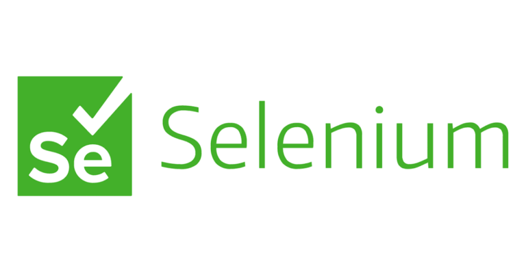

<div align="center">
  <a href="">
    
  </a>

  <p align="center">
    WEB UI Automation Testing Project
    <br />
    <a href="https://saucedemo.com/"><strong>| Saucedemo |</strong></a>
    <br />
    <br />
  </p>
</div>

## 📑 About the Project

<p align="justify">While you surfing on the internet then you end up on a website that really interesting. Pretty home page, init? You mumbling. Beside there the Front-end and UI/UX designer who work all the way for the catching-eye page, Quality engineer also has a role to mak sure that the page not break and functioning. It doesn't matter if the page had a beautiful page but fail to do the work. It's sad :woozy_face:. Luckly, with testing we can minimize that situation. In this project we will dive into a UI/UX testing world with automation with a website called Saucedemo. Happy cracking!</p>

<!--
## 📝 Reports

#### Login


#### Register


#### Chats

-->
## 🛠 Tools

**Automation :**


**Framework for automation:**


**Test Case Management:**


## 📱 Lets connect!

[](https://www.linkedin.com/in/rahdianabdi/)
[](https://github.com/rahdian-abdi)

## How to run the test
To run the this project, you can either just run the `CucumberTestSuite` test runner class, or run `mvn verify` from terminal.

This is how you run it :

1. Clone the repository
```json
$ git clone https://github.com/rahdian-abdi/saucelab-web-automation.git
```
2. In case there is a poput asked whether the project based on Maven or Gradle, choose Maven
3. Run this on the IDE terminal
```json
$ mvn clean verify
```

By default, the tests will run using Chrome. You can run them in Firefox by overriding the `driver` system property, e.g.
```json
$ mvn clean verify -Ddriver=firefox
```

The test results will be recorded in the `target/site/serenity` directory.

Happy Testing!
